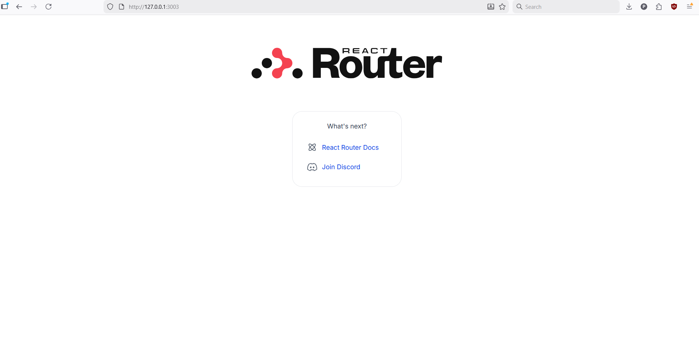

You can create a deployment of this app immediately by using this command. This creates a deployment on your local machine, using the version tag 1.6 of __njugen/todo-app__ image hosted on Docker Hub.


```
    kubectl apply -f https://raw.githubusercontent.com/Njugen/DevOpsWithKubernetes/refs/heads/1.6/the_project/manifests/deployment.yaml
```


After deployment, apply a service to it

```
    kubectl apply -f https://raw.githubusercontent.com/Njugen/DevOpsWithKubernetes/refs/heads/1.6/the_project/manifests/service.yaml
```

Go to http://localhost:8082 (or 127.0.0.1:8082 if the former does not work).

You should see:


